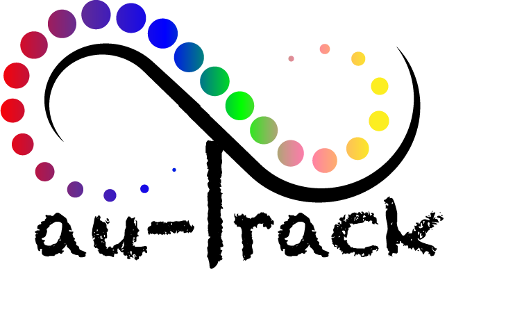
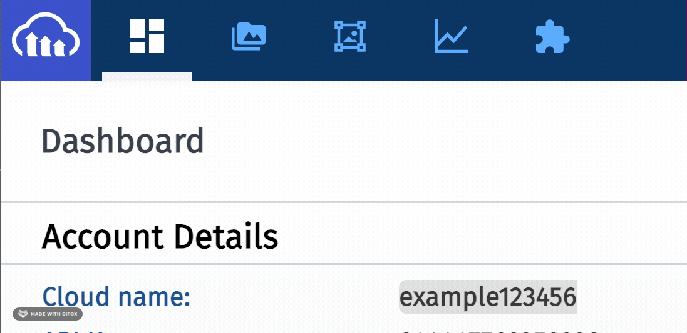
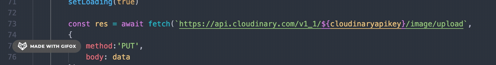
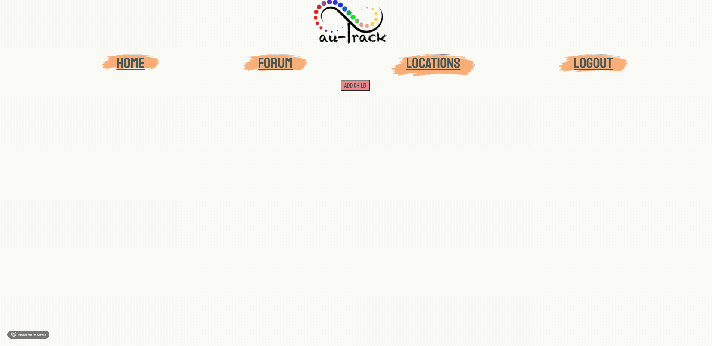
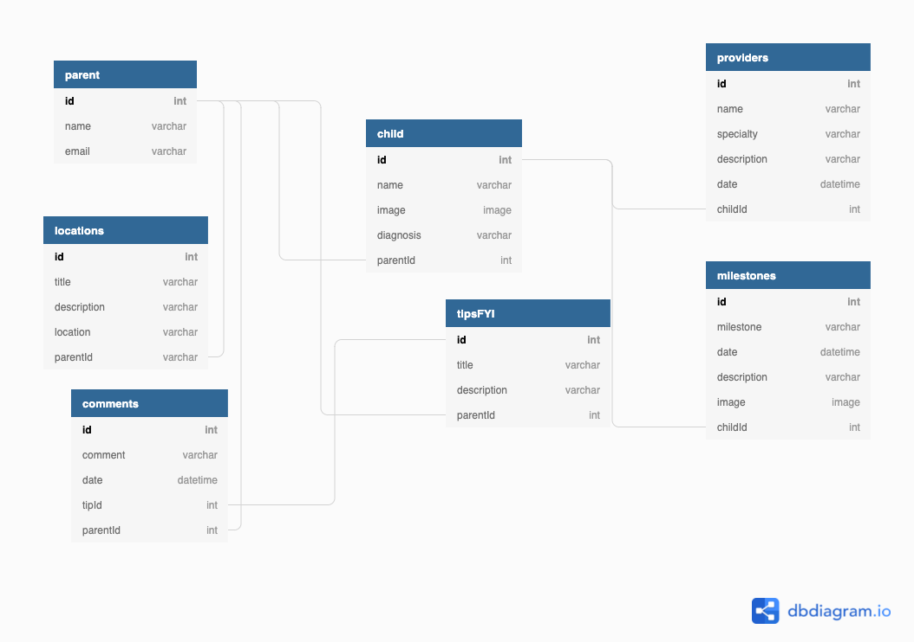
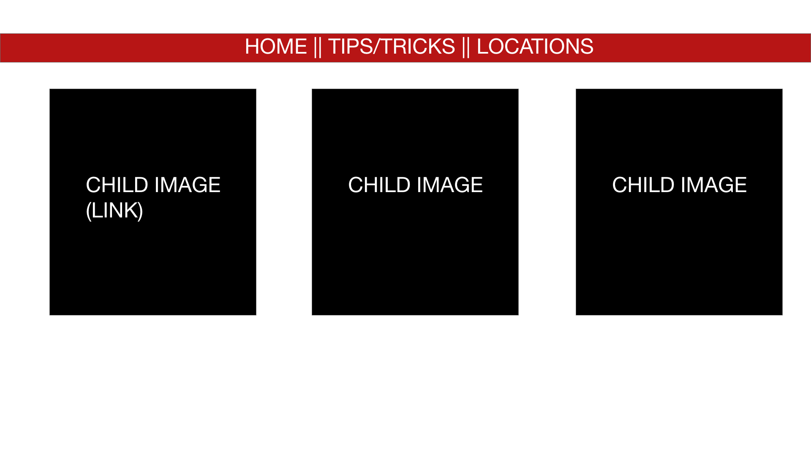
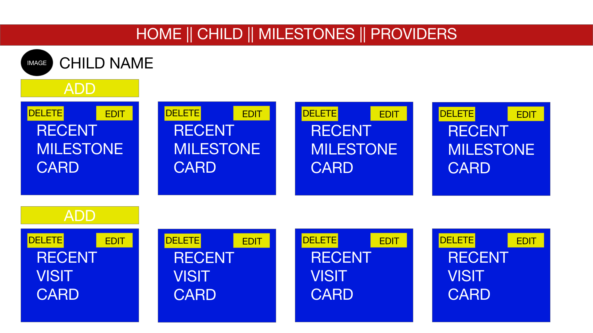
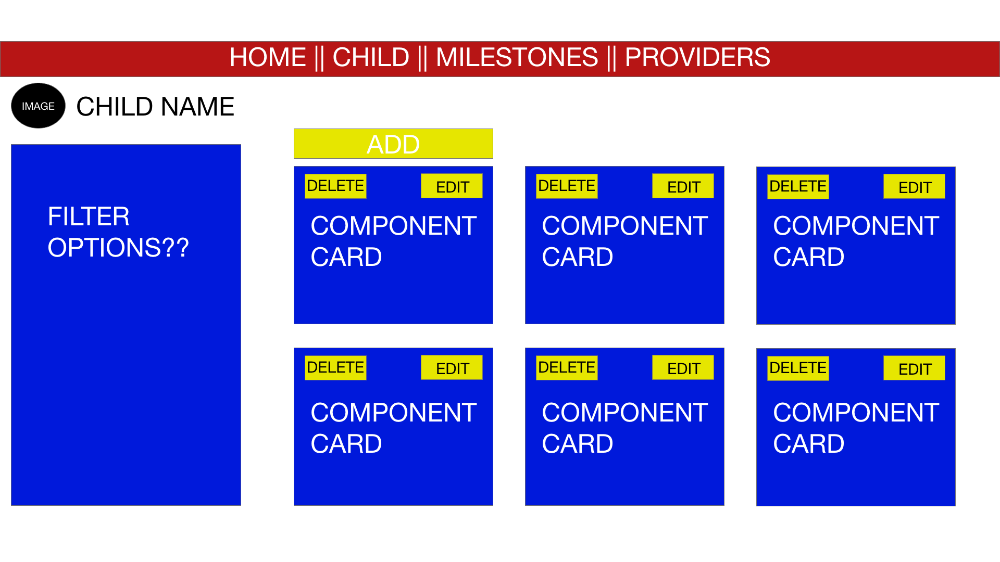
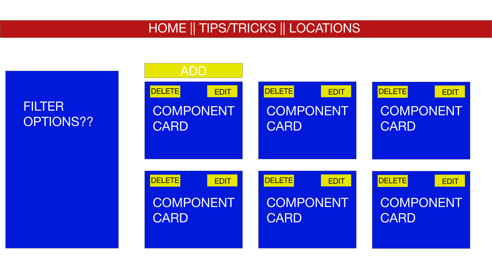

# Au Track

A one-stop tracking web-based application utilizing ReactJS with full CRUD functionality for parents and/or caregivers of autistic child(ren). There are private and public features to allow parents and caregivers to fulfill their needs. The private feature allows users to track milestones and care of their autistic child(ren). While the public feature allows users to share tips, articles, and autistic-friendly locations to the public community of other autistic parents/caregivers as well as ask questions. 

### Built With 
* ReactJS
* CSS
* HTML
* Adobe Photoshop
* Cloudinary 

## Getting Started

To get a local copy up and running follow these simple steps.

## Requirements

* VSCode
* Cloudinary API
* Git
* NodeJS

## Installation 

* npm 

    `npm install`

* Clone the repository 

    `git clone git@github.com:sxiong0519/au-track.git`

* Replace Cloudinary API Key in the **ChildForm.js** file, line 73 `${cloudinaryapikey}` with your **cloud name**

* Create a JSON Database file and copy the below into the file
    
    `{ 
    "parents": [],     
    "children": [],     
    "providers": [],     
    "milestones": [],     
    "locations": [],    
    "favoriteTips": []    
    }`

* Serve the database api
 
 `json-server -p 8088 -w database.json`

* Run the code

    `npm start`

## Design and Development

### DbDiagram.io - Entity Relationship Diagram

### WireFrame

